# Typescript: The Complete Developer's Guide - Stephen Grider

https://www.udemy.com/course/typescript-the-complete-developers-guide/

# Table of Contents

1. [Section 1: Getting Started with Typescript](#section-1-getting-started-with-typescript)
1. [Section 2: What is a Type System?](#section-2-what-is-a-type-system)
1. [Section 3: Type Annotations in Action](#section-3-type-annotations-in-action)
1. [Section 4: Annotations With Functions and Objects](#section-4-annotations-with-functions-and-objects)
1. [Section 5: Mastering Typed Arrays](#section-5-mastering-typed-arrays)
1. [Section 6: Tuples in Typescript](#section-6-tuples-in-typescript)
1. [Section 7: The All-Important Interface](#section-7-the-all-important-interface)
1. [Section 8: Building Functionality with Classes](#section-8-building-functionality-with-classes)
1. [Section 9: Design Patterns with Typescript](#section-9-design-patterns-with-typescript)
1. [Section 10: More on Design Patterns](#section-10-more-on-design-patterns)
1. [Section 11: Reusable Code](#section-11-reusable-code)
1. [Section 12: Advanced Generics](#section-12-advanced-generics)
1. [Section 13: Let's Build a Web Framework](#section-13-lets-build-a-web-framework)
1. [Section 14: Express + Typescript Integration](#section-14-express--typescript-integration)
1. [Section 15: Decorators](#section-15-decorators)
1. [Section 16: Advanced Express and TS Integration](#section-16-advanced-express-and-ts-integration)
1. [Section 17: React and Redux Class Components with Typescript](#section-17-react-and-redux-class-components-with-typescript)
1. [Section 18: React Functional Components with TypeScript](#section-18-react-functional-components-with-typescript)
1. [Section 19: Redux with Functional Components and TypeScript](#section-19-redux-with-functional-components-and-typescript)
1. [Section 20: Extras](#section-20-extras)

# Section 1: Getting Started with Typescript

   

   

   

   

   

   

   

   

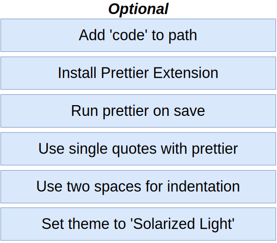
   

   

   

   

---

 

# Section 2: What is a Type System?

   

   

   

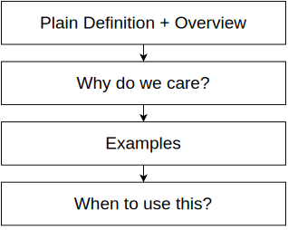
   

   

   

   

   

   

   

   

   

---

 

# Section 3: Type Annotations in Action

   

   

   

   

   

   

   

   

   

   

   

   

---

 

# Section 4: Annotations With Functions and Objects

---

 

# Section 5: Mastering Typed Arrays

   

   

   

   

---

 

# Section 6: Tuples in Typescript

   

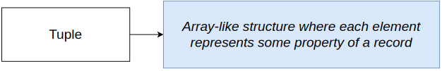
   

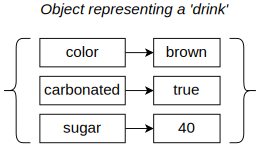
   

   

   

---

 

# Section 7: The All-Important Interface

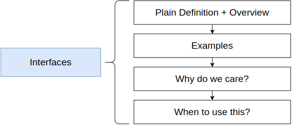
   

   

   

   

   

   

   

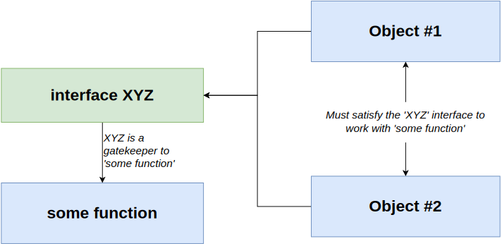
   

---

 

# Section 8: Building Functionality with Classes

   

   

   

   

   

---

 

# Section 9: Design Patterns with Typescript

   

   

   

   

   

   

   

   

   

   

   

   

   

   

   

   

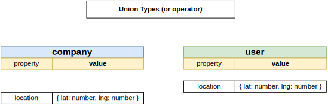
   

   

   

   

   

   

---

 

# Section 10: More on Design Patterns

   

   

   

   

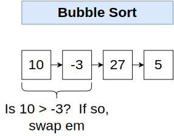
   

   

   

   

   

   

   

   

   

   

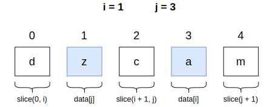
   

   

   

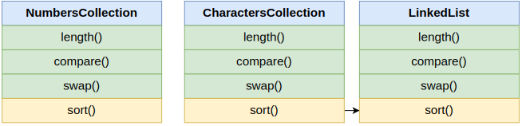
   

   

   

   

   

   

   

   

---

 

# Section 11: Reusable Code

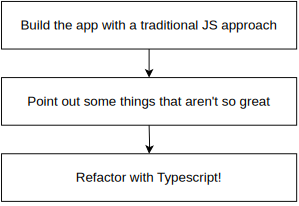
   

   

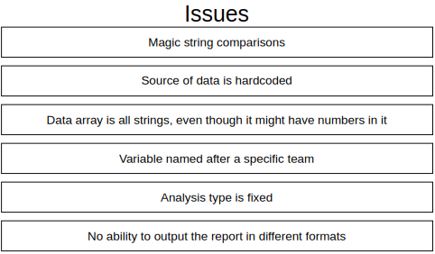
   

   

   

   

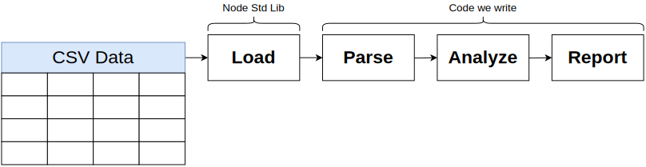
   

   

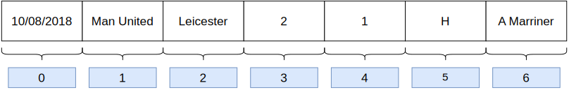
   

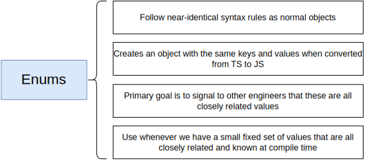
   

   

   

   

   

   

   

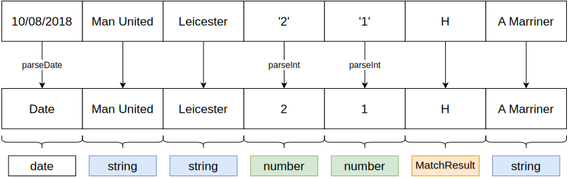
   

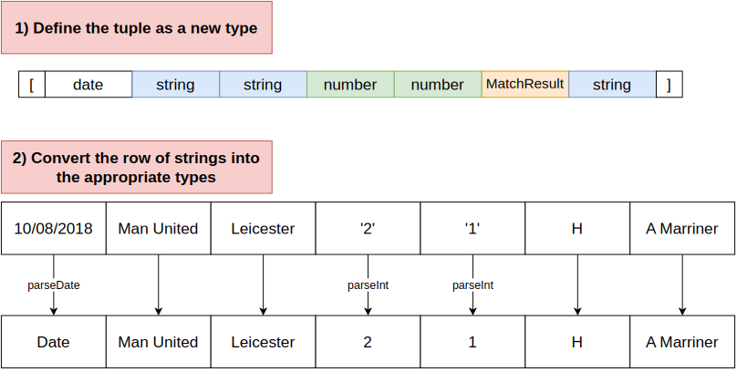
   

   

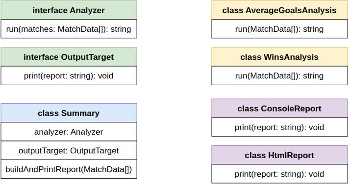
   

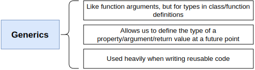
   

   

   

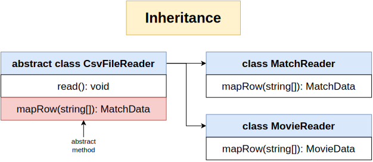
   

   

   

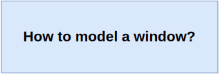
   

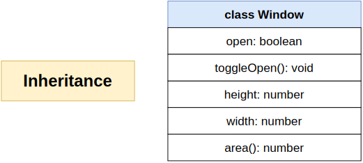
   

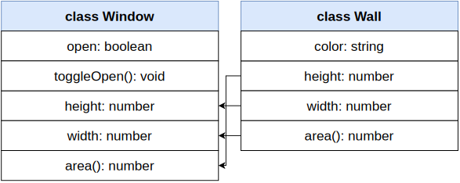
   

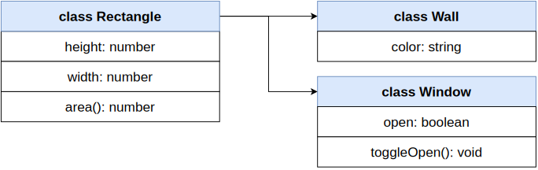
   

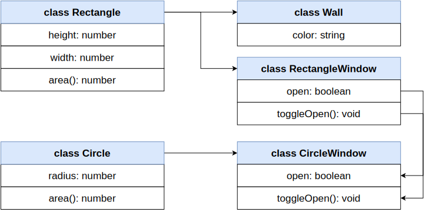
   

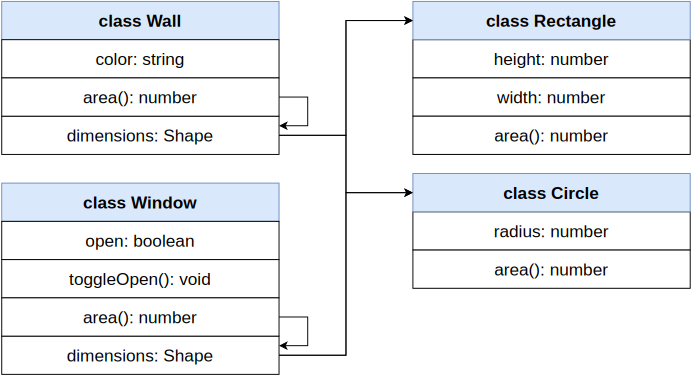
   

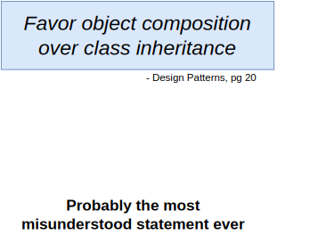
   

   

---

 

# Section 12: Advanced Generics

No diagrams

---

 

# Section 13: Let's Build a Web Framework

   

   

   

   

   

   

   

   

   

   

   

   

   

   

   

   

   

   

   

   

   

   

   

   

   

   

   

   

   

   

   

   

   

   

   

   

   

   

   

   

   

   

   

   

   

   

---

 

# Section 14: Express + Typescript Integration

   

   

   

   

   

   

   

   

   

   

   

---

 

# Section 15: Decorators

   

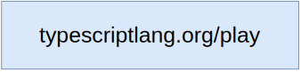
   

   

   

   

   

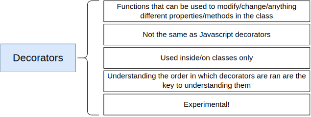
   

   

   

   

---

 

# Section 16: Advanced Express and TS Integration

   

   

   

   

   

   

   

---

 

# Section 17: React and Redux Class Components with Typescript

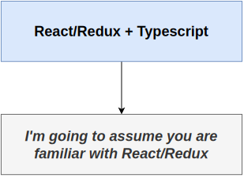
   

   

   

   

   

---

 

# Section 18: React Functional Components with TypeScript

---

 

# Section 19: Redux with Functional Components and TypeScript

---

 

# Section 20: Extras

---

 

# 02

   

   

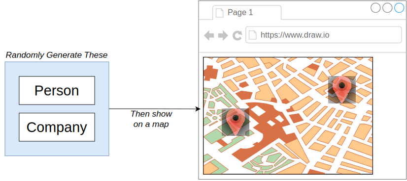
   

   

   

   

   

   

   

# 03

   

   

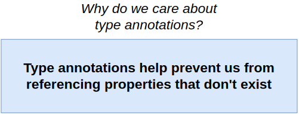
   

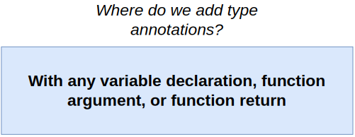
   

   

   

   

   

   

   

   

   

   

   

   

# 04

# 05

# 06

# 08

# 09

# 10

# 11

# 12

# 13

# 14

# 15

# 16

# 17

# 18

