# Section 11: Reusable Code

## Table of Contents

1. 

---

 

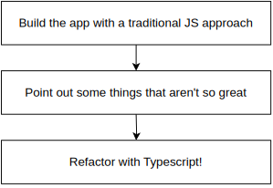
   

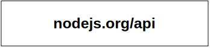
   

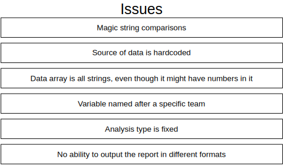
   

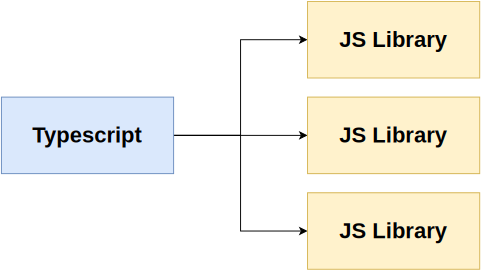
   

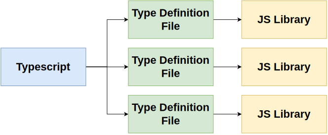
   

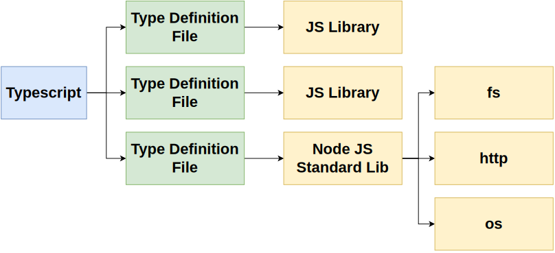
   

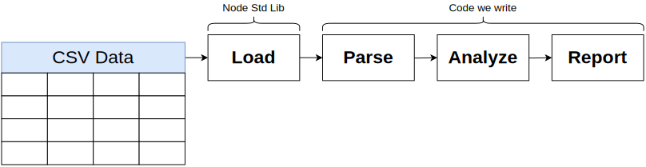
   

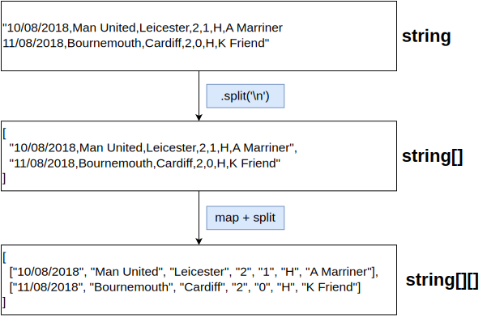
   

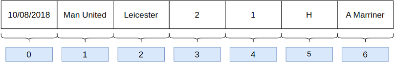
   

   

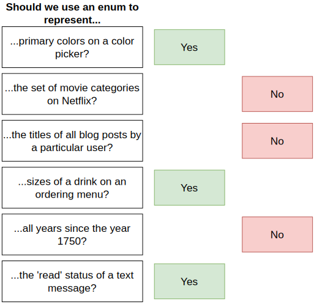
   

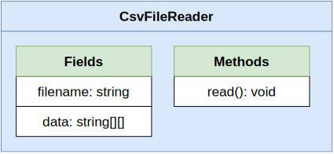
   

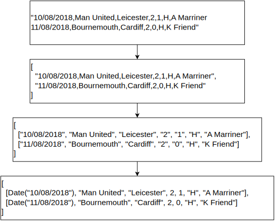
   

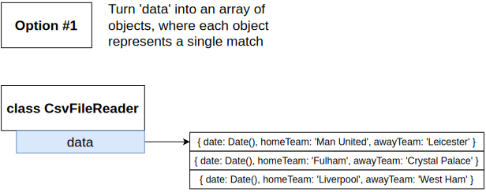
   

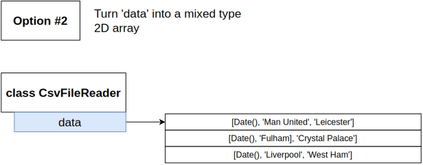
   

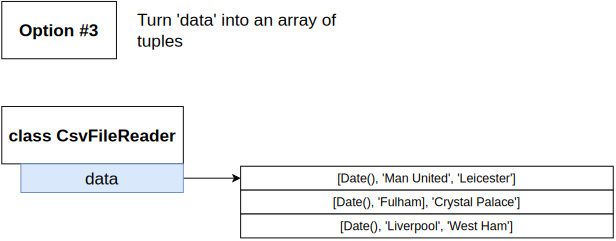
   

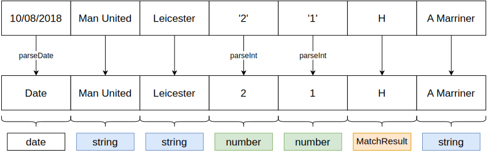
   

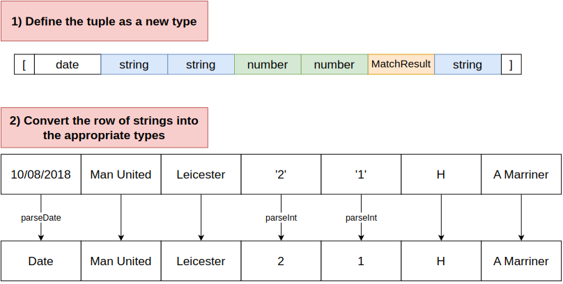
   

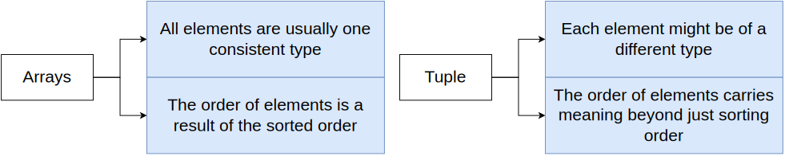
   

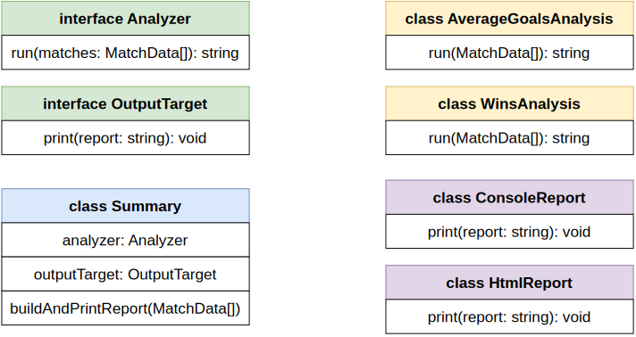
   

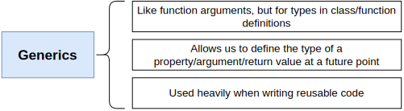
   

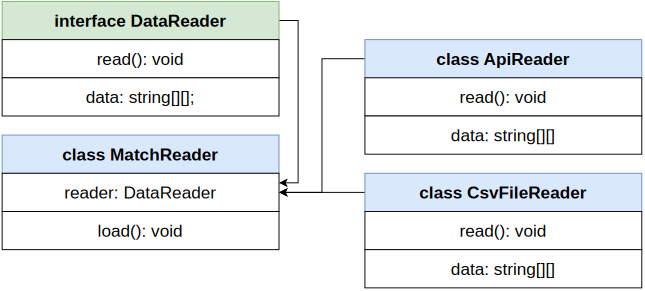
   

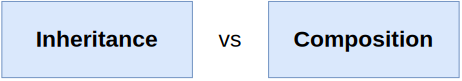
   

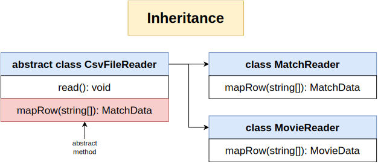
   

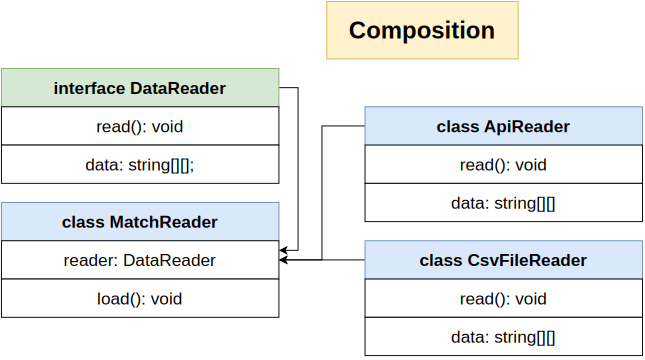
   

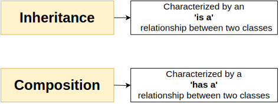
   

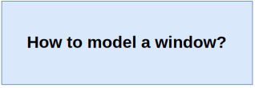
   

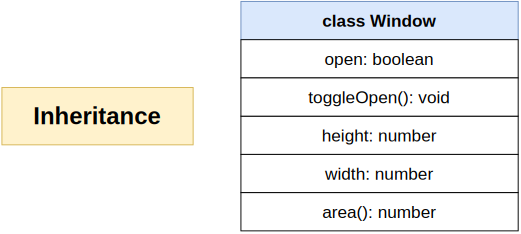
   

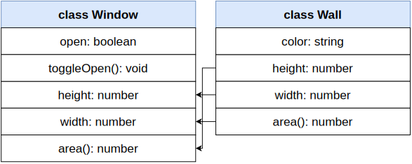
   

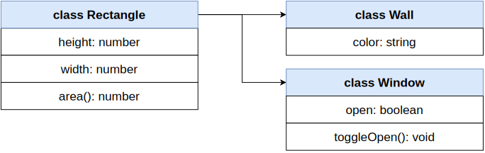
   

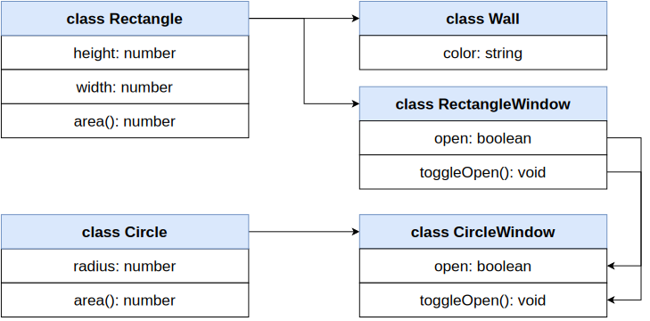
   

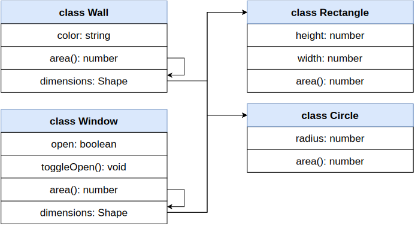
   

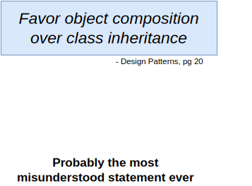
   

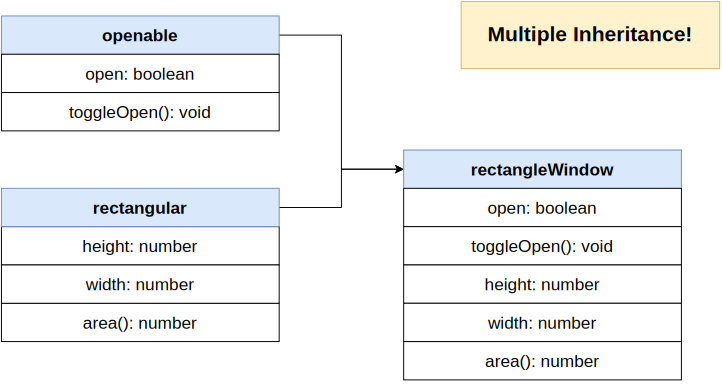
   
